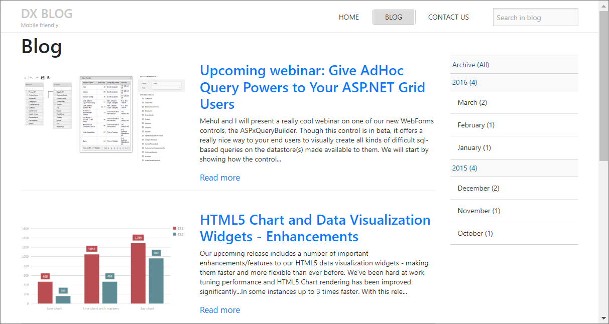

<!-- default badges list -->

<!-- default badges end -->
# ASP.NET MVC Extensions - A blog web site
<!-- run online -->
**[[Run Online]](https://codecentral.devexpress.com/t591214/)**
<!-- run online end -->
This example is based on the **Blog Web Site** project template available in the [DevExpress Template Gallery](https://docs.devexpress.com/AspNetMvc/402256/whats-installed/template-gallery). The template uses [DevExpress ASP.NET MVC extensions](https://docs.devexpress.com/AspNetMvc/7896/aspnet-mvc-extensions) and [Bootstrap](https://getbootstrap.com/) elements to create a responsive web application with blog functions and integrated full-text search.

## Files to Review

* [PagesController.BlogPosts.cs](./CS/WebBlog/Controllers/PagesController.BlogPosts.cs)
* [PagesController.Contacts.cs](./CS/WebBlog/Controllers/PagesController.Contacts.cs)
* [PagesController.Home.cs](./CS/WebBlog/Controllers/PagesController.Home.cs)
* [BlogPosts.cs](./CS/WebBlog/Models/BlogPosts.cs)
* [Comment.cs](./CS/WebBlog/Models/Comment.cs)
* [BlogPost.cshtml](./CS/WebBlog/Views/Pages/BlogPost.cshtml)
* [Contacts.cshtml](./CS/WebBlog/Views/Pages/Contacts.cshtml)
* [Home.cshtml](./CS/WebBlog/Views/Pages/Home.cshtml)
* [Search.cshtml](./CS/WebBlog/Views/Pages/Search.cshtml)
* [SearchGridViewPartial.cshtml](./CS/WebBlog/Views/Pages/SearchGridViewPartial.cshtml)
* [_Layout.cshtml](./CS/WebBlog/Views/Shared/_Layout.cshtml)

## Documentation

* [Template Gallery](https://docs.devexpress.com/AspNetMvc/402256/whats-installed/template-gallery)
* [Project Wizard](https://docs.devexpress.com/AspNetMvc/402253/whats-installed/project-wizard)

## More Examples

* [ASP.NET Web Form Controls - A blog web site](https://github.com/DevExpress-Examples/blog-web-site-webforms-project-template-from-devexpress-template-gallery-t590526)
